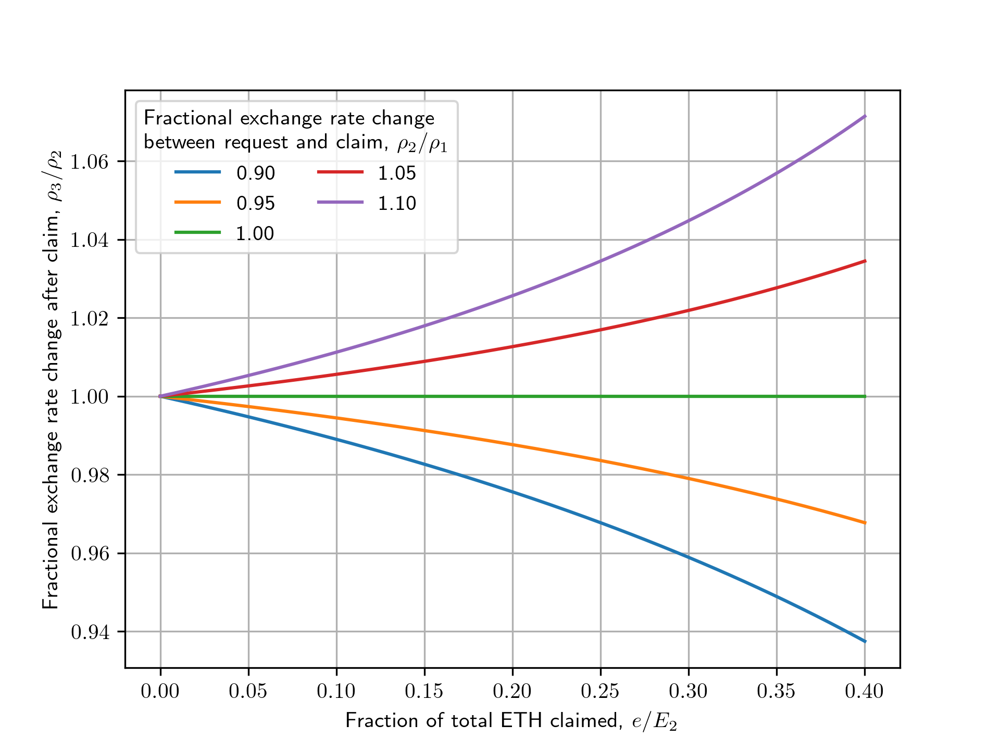

## A note on burning at claim-time

In our design, mETH is sent to the contract when the user does an unstake request, but it is not burned (which is what alters the exchange rate) until the request is claimed. This means that the user effectively fixes their rate at unstake time, and any further rewards on that stake are socialized gains for the remaining mETH holders.

As a consequence of burning at this point, it is the case that the delta for the exchange rate adjustment at claim time is slightly accelerated, and this scales with the amount of time between unstaking and claiming.

We have analyzed the effect on the rate and concluded that the difference is entirely negligible in realistic cases. For example, our calculations (see below) show that to affect the exchange rate by ~1%, a user would have to unstake 20% of the entire TVL in the protocol and wait about 1 year (assuming 5% in rewards) before claiming it.

Given that a user leaving an unclaimed request for a long time is extremely inefficient (they have locked money which is not earning rewards) and the TVL of the protocol is expected to be very large, we consider the likelihood of this affecting the protocol extremely small. In the normal case of a user unstaking a fraction of the TVL and claiming after a few days, the effect is almost immeasurable, so we do not consider this an issue.

For reference, we made this trade-off because it simplifies other parts of the protocol mechanics.

### Analysis

Assume a user submits the request to unstake $m$ mETH for $e$ ETH at exchange rate 

$$
\begin{aligned}
\rho_1 = \frac{E_1}{M_1} = \frac{e}{m}
\end{aligned}
$$

where $E_1$ and $M_1$ denote the current total controlled ETH and supply of mETH.
The user does not claim their ETH immediately but waits until the exchange rate has changed to

$$
\begin{aligned}
\rho_2 = \frac{E_2}{M_2},
\end{aligned}
$$

where $E_2$ and $M_2$ are defined in analogy to the above.
Since the delayed claim removes ETH and mETH at a ratio that is different to the current exchange rate, it will change the exchange rate to 

$$
\begin{aligned}
\rho_3 = \frac{E_2 - e}{M_2 - m}.
\end{aligned}
$$

One can obtain a compact expression for the relative change by dividing by $\rho_2$, substituting $M_2$ and $m$ and rearranging the terms as follows

$$
\begin{aligned}
\frac{\rho_3}{\rho_2} 
&= \frac{1}{\rho_2} \frac{E_2 - e}{M_2 - m} \\
&= \frac{E_2 - e}{E_2 - \frac{\rho_2}{\rho_1} e} \\
&= \frac{1 - \frac{e}{E_2}}{1 - \frac{\rho_2}{\rho_1} \frac{e}{E_2}}
\end{aligned}
$$

#### Numerical example

Assuming that the user claims 20% of the total controlled ETH (i.e. $e/E_2 = 0.2$) after the protocol has generated 5% of returns (i.e $\rho_2 / \rho_1 = 1.05$), the exchange rate will change by 1.2%

$$
\begin{aligned}
\frac{\rho_3}{\rho_2} 
&= \frac{1 - 0.2}{1 - 1.05 \cdot 0.2} = 1.012 \\
\end{aligned}
$$

